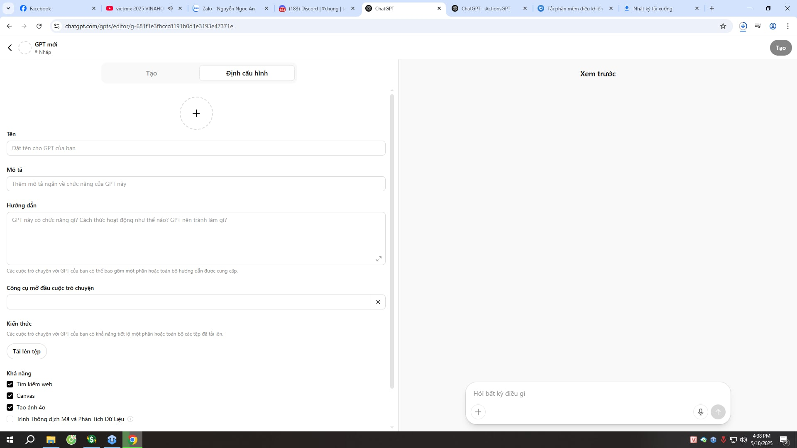

# Roadmap học AI Agent trong 8 tuần cùng với Aleotron

## Tuần 1: Python cơ bản
* Cài đặt Python, môi trường ảo
* Kiểu dữ liệu và biến
* Toán tử, Câu điều kiện
* Mảng 1 chiều và đa chiều, object
* Hàm cơ bản, Xử lý ngoại lệ

## Tuần 2: Python nâng cao
* Hàm nâng cao: lambda, *args, **kwargs
* OOP
* Thư viện
* os, json, datetime, time
* Requests
* FastAPI

## Tuần 3: 
* OpenAI SDK, parameters
    - Học cách sử dụng thư viện OpenAI. Có thể sử dụng của Gemini để đỡ phải trả phí
    ```python   
    from openai import OpenAI
    client = OpenAI(
        api_key="GEMINI_API_KEY",
        base_url="https://generativelanguage.googleapis.com/v1beta/openai/"
    )
    ```
    - Các tham số truyền vào của thư viện đó
* Custom GPTs
    - Phần này là sử dụng Code để tạo Custom GPTs, chứ không phải sử dụng trên web
    - Dưới đây là cấu tạo của Custom GPTs:
        
        - Cấu tạo của Custom GPTs gồm: 
            - Tên, mô tả ngắn, hướng dẫn (các chức năng của AI, cách hoạt động, nên tránh làm gì)
            - Công cụ mở cầu cuộc trò chuyện (cái phần này không cần thiết lắm)
            - Kiến thức: Phần này có thể đọc file hoặc làm gì đấy, nói chung là đưa vào trong Python là được. 
        - Sau khi có những cáu đó xong, thì sẽ đưa vào prompt:
        ```python
        prompt = """
        Bạn là một trợ lí ảo. 
        Tên của bạn là <tên>. 
        Nhiệm vụ của bạn là <mô tả ngắn>.
        Cách hoạt động của bạn là: <cách hoạt động>.
        Bạn cần tránh <làm gì>.
        Dưới đây là những kiến thức của bạn:
        <kiến thức 1>
        <kiến thức 2>"""
        ```          
        - Sau khi đã có prompt này, thì đưa vào trong `messages`
        ```python
        messages = [
            {
                "role": "system",
                "content": prompt
            }
        ]
        ```  
* Tool Use (Function Calling): Từ khóa tìm kiếm: `Function Calling`
    - Phần này để bổ trợ cho phần hành động của AI
    - Code mẫu:
    ```python
    from openai import OpenAI
    import json

    client = OpenAI(
        api_key="GEMINI_API_KEY",
        base_url="https://generativelanguage.googleapis.com/v1beta/openai/"
    )

    def get_weather(location: str, unit: str):
        return f"Getting the weather for {location} in {unit}..."
    tool_functions = {"get_weather": get_weather}

    tools = [{
        "type": "function",
        "function": {
            "name": "get_weather",
            "description": "Get the current weather in a given location",
            "parameters": {
                "type": "object",
                "properties": {
                    "location": {"type": "string", "description": "City and state, e.g., 'San Francisco, CA'"},
                    "unit": {"type": "string", "enum": ["celsius", "fahrenheit"]}
                },
                "required": ["location", "unit"]
            }
        }
    }]

    response = client.chat.completions.create(
        model="gemini-2.0-flash",
        messages=[{"role": "user", "content": "What's the weather like in San Francisco?"}],
        tools=tools,
        tool_choice="auto"
    )

    tool_call = response.choices[0].message.tool_calls[0].function
    print(f"Function called: {tool_call.name}")
    print(f"Arguments: {tool_call.arguments}")
    print(f"Result: {get_weather(**json.loads(tool_call.arguments))}")
    ```
    - Đọc thêm tại: [OpenAI Function Calling](https://platform.openai.com/docs/guides/function-calling/function-calling?api-mode=responses)
* Structure Output
    - Là định dạng trả ra mỗi khi AI trả lời. Thường sẽ là dạng json
    - Ví dụ:
        ```python
        from openai import OpenAI
        import json

        # Initialize OpenAI client that points to the local LM Studio server
        client = OpenAI(
            api_key="GEMINI_API_KEY",
            base_url="https://generativelanguage.googleapis.com/v1beta/openai/"
        )

        # Define the conversation with the AI
        messages = [
            {"role": "system", "content": "You are a helpful AI assistant."},
            {"role": "user", "content": "Create 1-3 fictional characters"}
        ]

        # Define the expected response structure
        character_schema = {
            "type": "json_schema",
            "json_schema": {
                "name": "characters",
                "schema": {
                    "type": "object",
                    "properties": {
                        "characters": {
                            "type": "array",
                            "items": {
                                "type": "object",
                                "properties": {
                                    "name": {"type": "string"},
                                    "occupation": {"type": "string"},
                                    "personality": {"type": "string"},
                                    "background": {"type": "string"}
                                },
                                "required": ["name", "occupation", "personality", "background"]
                            },
                            "minItems": 1,
                        }
                    },
                    "required": ["characters"]
                },
            }
        }

        # Get response from AI
        response = client.chat.completions.create(
            model="gemini-2.0-flash",
            messages=messages,
            response_format=character_schema,
        )

        # Parse and display the results
        results = json.loads(response.choices[0].message.content)
        print(json.dumps(results, indent=2))
        ```
        - Đọc thêm tại đây: [LM Studio Structure Output](https://lmstudio.ai/docs/app/api/structured-output#structured-output)
* MCP Server
* MCP Client

## Tuần 4: Chatbot
* Lý thuyết: Basic RAG, Advanced RAG, Agentic RAG
* Chunking, Embedding
    - Chunking: 
        - Là chia nhỏ 1 bài văn dài thành nhiều đoạn nhỏ
        - Thường chunk size là 512 hoặc 1024 (tùy vào độ dài của model Embedding)
        - Chunk overlap là độ dài mà nó sẽ lấy thêm ở khoảng trước đó. Ví dụ:
        `Hôm nay là một ngày đẹp trời để học về AI AGent`
        `Chunk 1: Hôm nay là một ngày đẹp`
        `Chunk 2: ______________ ngày đẹp trời để học về`
        Thì chữ `ngày đẹp` có ở kết thúc của chunk 1, và là bắt đầu của chunk 2, thì nó là chunk overlap
        Xem thêm tại: [ChunkViz](https://chunkviz.up.railway.app/)
    - Embedding:
        - Là chuyển văn bản dạng text sang dạng vector. Vì Qdrant và FAISS là cơ sở dữ liệu lưu dạng vector. Dùng cho tìm kiếm văn bản, dựa theo ngữ cảnh gần giống nhất. Ví dụ như mình cần tìm kiếm là `phổ biến`, thì cơ sở dữ liệu sẽ trả về các từ liên quan như `nổi tiếng`, `common`, ...
* Qdrant, FAISS
* Thực hành: Basic RAG
Seminar Chatbot RAG: [Link record](https://www.youtube.com/watch?v=EdJZ38rrKk0)
* Framework LangChain
* Framework LlamaIndex

## Tuần 5: Automation
## Tuần 6: Agent
## Tuần 7: Multi Agent
## Tuần 8: Deploy 
