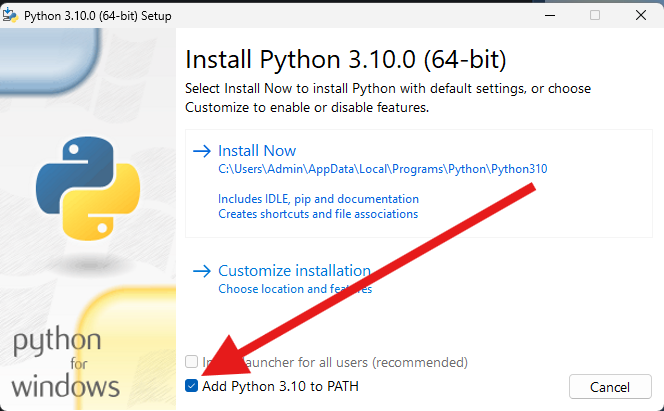
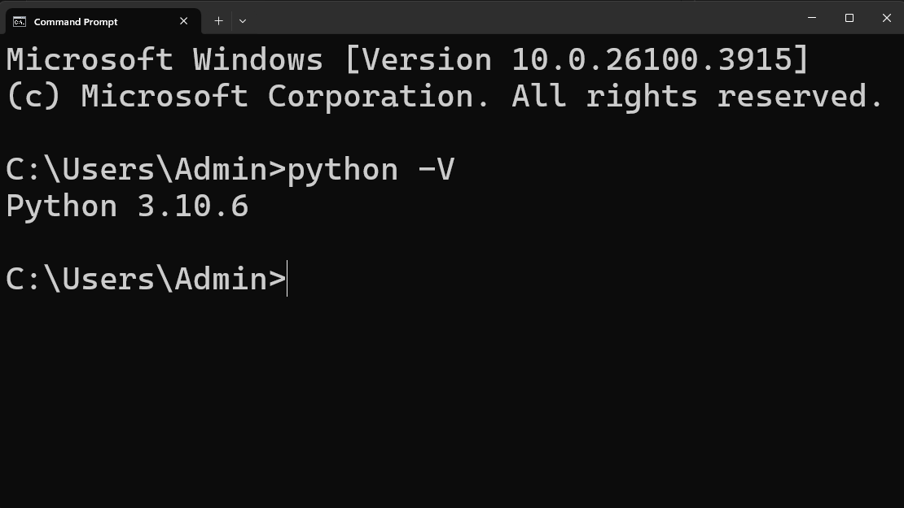
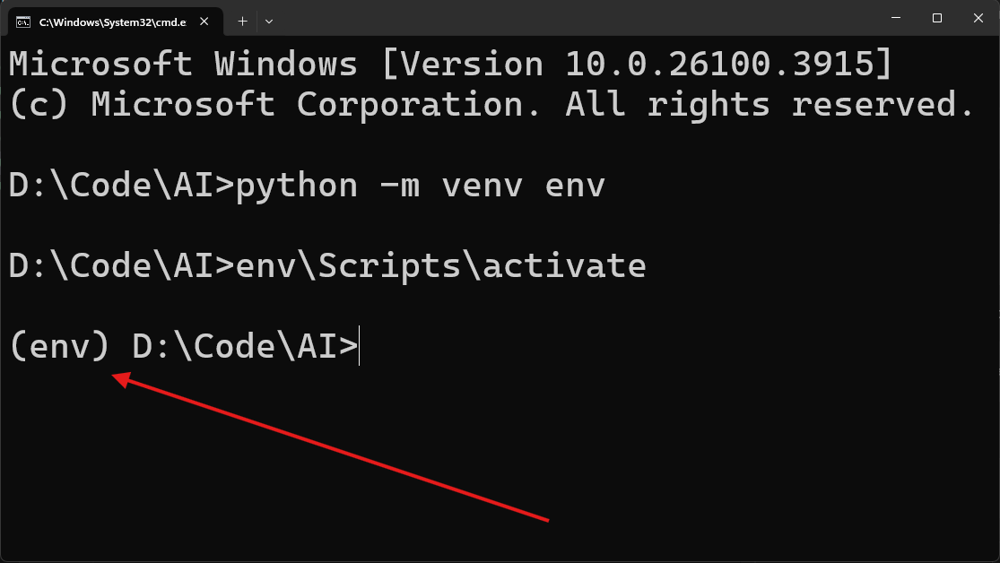

# Tải và cài đặt **Python**
* **Bước 1**: Tải Python

Nên sử dụng Python 3.10: [Tải Python 3.10 tại đây](https://www.python.org/ftp/python/3.10.0/python-3.10.0-amd64.exe)

* **Bước 2**: Cài đặt Python

Sau khi đã tải thành công, đến bước tiến hành cài đặt. Nó sẽ hiện ra như này. Mọi người nhớ ấn vào **Add Python 3.10 to PATH**


* **Bước 3**: Khi đã cài đặt xong. Sử dụng **Terminal** để kiểm tra



# Tải và cài đặt **Môi trường ảo**

* **Bước 1**:Tải môi trường ảo

Mở Terminal lên và nhập:
```python
pip install virtualenv
```

* **Bước 2**: Cài đặt môi trường ảo

Sau khi đã tải xong môi trường ảo, thì bật **Terminal** ở nơi mà các bạn muốn đặt môi trường ảo.

Sử dụng câu lệnh sau để tạo môi trường ảo

```python
python -m venv <Tên>
```

Ví dụ:

```python
python -m venv env
```

Sau khi đã cài đặt xong, thì kích hoạt môi trường ảo theo lệnh sau:

```python
<Tên đã tạo>\Script\activate
```

Ví dụ:

```python
env\Script\activate
```

Nếu hiện ra như này là đã thành công

